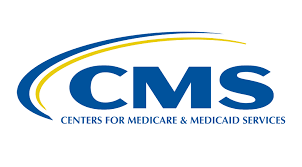

# DataScience-Risk-Minimization-For-Medical-Insurance-Company

## Association overview
The Centers for Medicare & Medicaid Services (CMS) is a federal agency within the United States Department of Health and Human Services (HHS) that administers the Medicare program and works in partnership with state governments to administer Medicaid, the Children's Health Insurance Program (CHIP), and health insurance portability standards.
## Problem
People nowadays buy insurances to prevent risk from happening, especially for medical insurance. In order to save cost, insurance companies have to evaluate patients’ condition before setting a price. So, the goal of my project is to use machining learning method to predict different levels price that the insurance company  should assign to each patient in each Skilled Nursing Facility.
## Methods
First, I will use K-Mean algorism to find several clusters and decide which level of price should assign to each cluster. Second, I will take column ‘Average HCC Score’  as my target cell, the score which is greater than 4.6, the mean of the column, as higher cost category, the score which is less than 4.6 as lower cost category, and use Naïve Bayes and SVM model to classify the data. At last, I will use confusion matrix to evaluate the accuracy.
## Conclusion
* Performance of each model
* Which model is the best for insurance company to assign cost?
